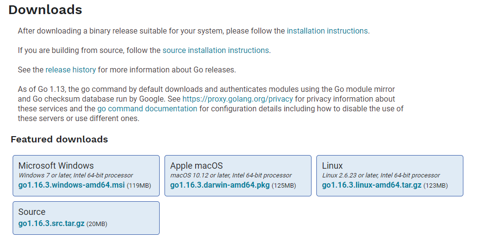

# Golang по TDD

## Установка.
Скачать [golang](https://golang.org/dl/ "golang")


Либо можно установить через:
- Chocolate
- apt, dnf, pacman...
- или через другой известный вас способ, либо можете собрать из исходников.

## Минимальный код для запуска:
```go:
package main

func main(){
	println("Hello")
}
```

## Минимальный код с демонстрацией импорта другого пакета:
```go:
package main

import "fmt"

func main(){
	fmt.Println("Hello")
}
```

Это отличный пример кода, для демонстрации golang.
Первая строчка задает именование пакета, для запуска программы нужно указать
что этот пакет `main`(главный). Но для запуска программы этого не достаточно.
Мало сказать что пакет является главным, нужно указать и точку запуска.
Для этого используется функция с именем `main`(главная).

Для работы с нужными пакетами(библиотеками) необходимо импортировать 
через ключевое слово (падам падам) `import`.

Для запуска программы нужно получить бинарный файл. 
Для этого мы можем выполнить:
```sh:
go build -o main ; ./main
```
После чего мы увидим в терминале `Hello`. Но для обучения и иногда для работы это будет немного сложно. Поэтому используем упрощенную версию для этого дела: 
```sh:
go run main.go
```
После чего получим тот же самый вывод, но у нас не будет в папке создан бинарный файл.


## Введение в тестирование.
Так как уроки основаны на TDD, нужно ввести немного в курс дела.
В go очень много готовых инструментов и инструмент для тестирование имеется из коробки.

Инструмент тестирования работает с файлами у которых имя заканчивается на `_test.go`.

Простой пример тестирования. Так как мы работает по TDD, нужно написать в первую очередь тест.

## numbers_test.go:
```go:
package numbers

import "testing"

func TestSum(t *testing.T){
	if sum(2, 2) != 4 {
		t.Fatal("Функция не правильно считает")
	}
}
```
Файл назвали `numbers_test.go`, имя файла как можно заметить заканчивается на `_test.go`. Для тестирования понадобится инструмент, который нам поможет. Поэтому мы импортирует покет тестирования `import "testing"`. Функция которая будет запускать тестирование, должна начинаться с ключевого слова `Test` затем обычно указывают имя тестируемой функции, у нас эта функция будет `sum`, поэтому назовем функцию для тестирования `TestSum`. И будем ждать стандартные параметры которые нам помогут в тестировании. Через конструкцию `if` проверяем правильность работы и если он не верен вернем ошибку.

## numbers.go:
```go:
package numbers

func sum(a, b int) int {
	return a + b
}
```

# Объявление и инициализация переменных:
```go:
var i int
const ii = 10

var (
	a,b,c int
	d int
	e = 10
)

f := 1
```