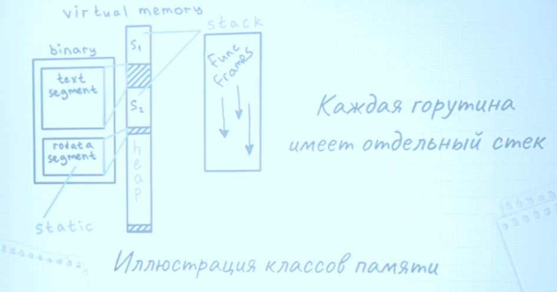

# Статическая память (STATIC)
Не алоцируются во время работы программы, алоцированы до того как приложение стартовало, они уже записаны в бинарнике.

* Никогда не очищается
* Не требует выделения(выделена заранее)
* Глобальные переменные
  * Инициализация внутри пакета `init`
* Так называемые statictmp значения
  * Не требует инициализации

# STACK
В `Go` не использует системный `stack`(исключение runtime systemstack), стек горутин равен 2КБ
```
runtime/stack.go

// The minimum size of `stack` used by `go` code
_StackMin = 2048
```
При запуске функции в go, функция проверяет хватает ли ей места в стеке, если места не хватает `go` пытается нарастить память, в противном случает создает новый `stack` и переносит туда данные. Может вызывать изломы производительности.

- Быстрая память, почти всегда имеет константное выделение памяти
- Очищается при возврате из функции (не нужен сборщик мусора)
- Выделяется смещением SP регистра
  - Регистр ассемблера SP - это указатель стека обеспечивает использование стека в памяти, позволяет временно хранить адреса и иногда данные.
- Локальные переменные
- Входные/Выходные параметры функции
- Память под non-escaping данные

Фрэйм - это хранилище для локальных данных, параметров и результатов функции.

# Куча (HEAP)
Хранятся все данные которые смогли пережить функцию в которой они были созданы.

- Очищается сборщиком мусорам
- Выделяется менеджером памяти
- Память под escaping

Что всегда хранится в куче:
- Данные, хранимые по не локальным указателям.
- Крупные объекты > ~64KB
- Данные интерфейсного значения, как правило хранятся в куче.
- make когда размер не известен `make([]int, x)`, но в `stack` `make([]int, 10)

Примеры:
```go:
func noAlloc()int{
  x:=new(int) // указатель на x локален
  return *x
}

func alloc()*int{
  x:=new(int)
  return x // x - убегает
}
```

## escape analysis: просмотреть где идет утечка памяти
```go tool compile -m main.go```

```go build -gcflags="-m=2" main.go```
-m может иметь значение от 1-4, определяя количество информации об оптимизациях

- does not escape       - осталось в стэке
- escape to heap        - ушло в кучу
- leaking param         - в функции параметр утекает
- leaking param content - параметр объекта утекает


